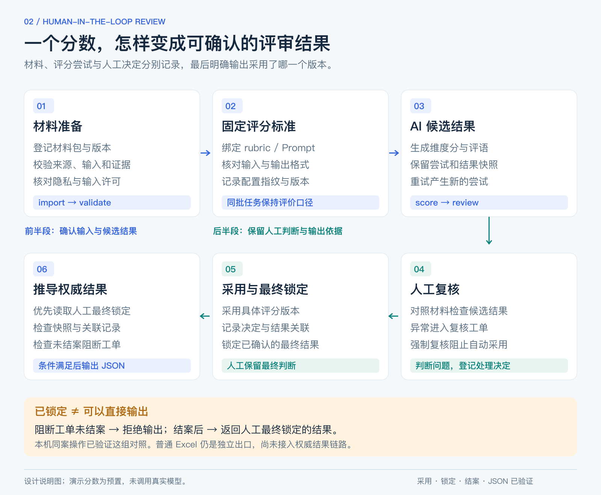
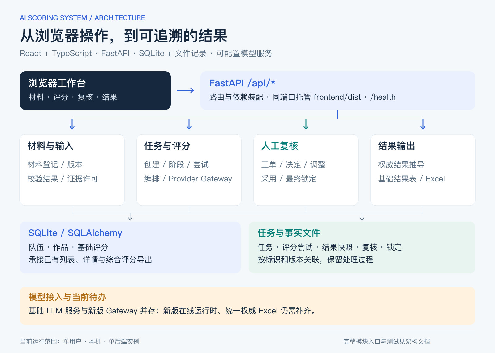

# AI Scoring System

**一个把作品材料、AI 评分和人工复核放在一起的评审工作台。**

[快速开始](#快速开始) · [工作流程](docs/WORKFLOW.md) · [系统架构](docs/ARCHITECTURE.md) · [源码导航](#从哪里读代码) · [测试与当前进展](docs/VALIDATION.md)

## 为什么做这个项目

批量评审作品时，很多时间花在收材料、找对应文件、写评语和反复核对上。即使 AI 能给出一个分数，评委还是需要看依据、处理异常，再确认最终结果。

我在教育测评工作中做了 AI Scoring System，把这些步骤放进同一套应用。AI 给出维度分和评语，评委对照材料复核，系统记录采用了哪次结果、哪个版本已经最终确认。我负责业务规则、流程设计、AI 辅助开发和使用验收。

项目历次迭代累计用于约 **2000份作品真实评审**。评委会直接复用 AI 评语，把分数作为重要参考。按实际使用经验估算，包含材料收集整理、评分和复核的内部评审整体用时节省 **80%以上**，没有做严格配对计时。

## 可以做什么

- **集中查看材料与评分：** 作品、源代码、交互记录和材料状态对应到具体条目，维度分和评语一起呈现。
- **按版本记录评分过程：** 评分任务绑定输入与评价标准，保留每次尝试和结果快照。
- **处理需要人工介入的情况：** 通过复核工单记录问题和处理决定，强制复核阻止自动采用。
- **确认最终结果：** 采用具体评分版本，记录人工最终锁定，输出前检查仍未结案的阻断工单。
- **导出已确认结果：** 按评分任务选择条目，Excel、Word、CSV统一读取已采用或人工锁定的结果；未结案、缺失记录和版本变化会阻止下载。文件保留分数来源与版本编号。

## 快速开始

需要 **Python 3.11、uv、Node.js 24 LTS 和 npm**。首次安装需要下载依赖。先运行带有12个虚构案例的本地工作台，不需要 API Key。

~~~bash
git clone https://github.com/chenbaitao88-ctrl/ai-scoring-system.git
cd ai-scoring-system
uv sync --frozen
npm ci --prefix frontend
npm run build --prefix frontend
~~~

macOS 启动：

~~~bash
bash scripts/start_demo.command
~~~

Windows PowerShell 启动：

~~~powershell
powershell -File scripts/start_demo.ps1
~~~

打开 [http://127.0.0.1:8000](http://127.0.0.1:8000)。macOS 可运行下面的检查，并用项目脚本停止服务：

~~~bash
bash scripts/accept_demo.sh
bash scripts/stop_demo.command
~~~

数据保存在被 Git 忽略的 runtime/demo/ 中。默认启动使用合成材料与预置评分，不调用模型。在线调用方式和新版流水线的配置限制见[模型与运行配置](docs/CONFIGURATION.md)。

新建演示默认保留待处理状态。体验已确认结果的下载，见[导出操作与离线复现](docs/EXPORTS.md)。

更详细的[运行手册](docs/RUNBOOK.md)包含端口、日志与故障处理。Intel Mac 也保留了[专用安装说明](docs/MACOS_INTEL.md)。

## 系统怎样组织

前端使用 React、TypeScript 和 TDesign；FastAPI 提供接口并托管构建后的页面。SQLite 保存队伍、作品和基础评分，任务、评分尝试、复核与权威结果另有文件记录。

我把材料准备、模型调用和人工确认拆开，是为了让每一步都有明确输入和状态。出现异常时，可以回到对应阶段处理；输出结果时，也能追溯究竟采用了哪份材料、哪次评分和哪条人工决定。

[阅读完整架构与设计取舍](docs/ARCHITECTURE.md)

## 从哪里读代码

| 想了解什么 | 实现入口 | 对应测试 |
|---|---|---|
| 前后端怎样连接 | [应用入口](backend/main.py) · [前端路由](frontend/src/App.tsx) · [API客户端](frontend/src/services/api.ts) | [接口测试](tests/test_scoring_pipeline_routes.py) |
| 材料怎样进入评分任务 | [材料登记](backend/services/evidence_registration_service.py) · [任务创建](backend/services/scoring_task_creator.py) | [任务创建测试](tests/test_scoring_task_creator.py) |
| 评分过程怎样推进 | [任务管理](backend/services/pipeline_task_manager.py) · [评分编排](backend/services/scoring_pipeline_orchestrator.py) | [编排测试](tests/test_scoring_pipeline_orchestrator_dry_run.py) |
| 怎样保留不同评分版本 | [评分事实存储](backend/services/score_attempt_store.py) | [存储测试](tests/test_score_attempt_store.py) |
| 人工决定怎样生效 | [复核记录](backend/services/review_case_store.py) · [人工调整](backend/services/manual_adjustment_service.py) | [采用集成测试](tests/test_scoring_pipeline_review_application_integration.py) |
| 哪个结果可以输出 | [权威结果推导](backend/services/result_derivation_service.py) · [三格式导出](backend/services/authoritative_export_service.py) | [结果推导测试](tests/test_result_derivation.py) · [文件导出测试](tests/test_authoritative_file_export.py) |

测试：

~~~bash
uv run --frozen python -m pytest -q -m "not slow"
~~~

当前版本的实测环境、结果和已知问题记录在[验证说明](docs/VALIDATION.md)。

## 当前版本与接下来要做的事

当前运行方式是单用户、本机、单后端实例。完整前后端、业务服务、测试和合成案例都在仓库中。

- 补齐新版流水线的在线执行运行时配置，完成真实 Provider 的端到端验证。
- 改善状态与错误提示，减少用户在不同页面之间理解状态的成本。
- 建立固定人工基准样本，评估模型评分一致性和人工修改情况。

这些待办不影响阅读完整实现和运行本地工作台，但还不能据此声称多用户生产部署或模型效果已经验证。

## 参与与许可

欢迎通过 Issue 反馈安装问题、流程建议或可复现的错误。提交问题时请使用虚构材料，不附真实作品、个人信息、运行数据库或凭据。

代码采用 [MIT License](LICENSE)。[贡献说明](CONTRIBUTING.md) · [安全说明](SECURITY.md)
