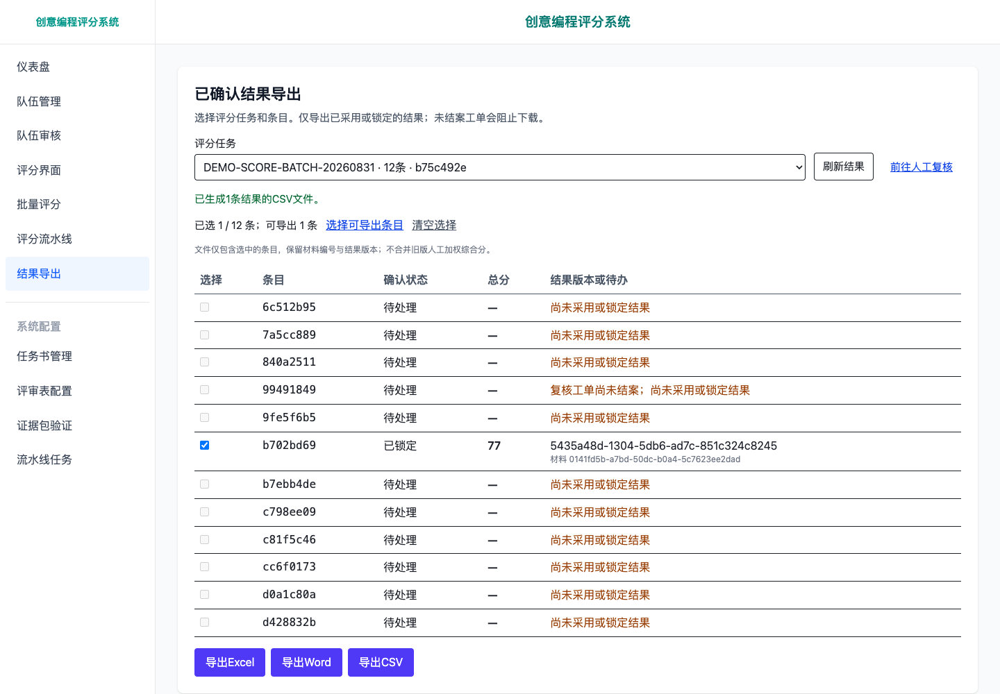

# 已确认结果导出

Excel、Word和CSV都从同一个权威结果服务生成。用户先选择评分任务，再明确选择条目；文件包含条目、材料、结果版本、评分尝试、采用/锁定记录和分数。旧版队伍综合分留作历史参考，不重新加权到这些文件中。

## 操作与保护条件

1. 打开“结果导出”，选择评分任务。每条结果显示确认状态、分数及阻断原因。
2. 勾选可导出条目，或点“选择可导出条目”。页面明确显示已选数量和任务总数。
3. 下载Excel、Word或CSV。页面会提交预览时的版本编号；结果发生变化时，下载失败并刷新列表，需要重新选择。

人工最终锁定优先于已采用结果；有新评分尝试不会自动替换锁定版本。未结案的阻断工单、没有采用记录、缺失或损坏快照均不能导出。直接请求整个任务时，任何失败条目都会阻止整份文件，不会静默漏项。生成文件前后再次检查来源与任务修订；这是单用户、本机单实例范围内的版本检查，不是多用户事务锁。

文件不包含原始材料、路径、模型响应或评语。空白主观分表示快照未提供该值，不代表零分。Excel的数值保持数值类型，文本不会执行为公式；CSV对潜在公式前缀进行转义。Word为每个条目单独起页。

下载不会自动推进任务生命周期，任务仍可显示 `export/pending`。工单结案是独立人工操作，不是评分、采用或锁定的附带动作。

## 离线复现一个可下载条目

先按[首页](../README.md)启动演示。默认12个合成案例包含未采用和待复核状态，不会自动放行。以下操作只处理 `DEMO-M-006` 的预置最终锁定对应工单，不改分数、不调用模型；其余条目继续保留原状态。

1. 在“结果导出”选择合成评分任务，先查看“复核工单尚未结案”的阻断说明。任务ID也可从本地合成清单 `runtime/demo/data/demo_phase11_manifest.json` 的 `scoring_task_id` 字段取得。
2. 打开“评分流水线”，输入该任务ID并查询，切到“复核队列”。
3. 打开状态为“复核中”、已有77分采用结果与最终锁定的工单，核对评分历史及采用/锁定信息，点击独立按钮“确认复核并结案”。
4. 页面显示结案结果并重新检查该条目导出资格。若仍有其他阻断，按结果页原因继续处理；结案不保证所有条目都可导出。
5. 回到“结果导出”，刷新或重新选择任务，勾选该已锁定条目，下载三种文件。

2026-09-08合成浏览器实测：总分77，维度分17、23、22、15，三个下载文件与权威结果API的分数和版本ID一致。本步骤不验证真实模型重新评分。

## 受限结案接口

`POST /api/scoring-pipeline/tasks/{task_id}/items/{item_id}/review-cases/{case_id}/resolve`

请求仅含 `expected_revision`（正整数）和 `expected_adoption_id`（页面看到的当前采用ID）。后端在现有review-store条目锁内解析采用所依据的决定，核验工单、决定、采用、评分事实和可选最终锁定的绑定，再执行 `in_review → resolved`，记录revision及 `CASE_RESOLVED`。不接受任意目标状态、客户端分数或客户端指定的结案决定。

成功200返回工单ID、状态、新revision和结案决定ID。无效请求400、工单或决定不存在404、版本过期/已结案/采用变化/评分事实无效409。重复提交不追加事件，返回冲突后应刷新；锁定动作不会自动结案。仅支持当前工单版本上的有效人工采用决定，或有完整关联记录的人工调分决定。已重开的工单须重新复核，不能沿用旧结案决定。

关联校验与工单写入共享review-store的条目锁；attempt-store独立，不承诺跨存储原子事务。未改变 `must_review` 的自动采用保护、最终锁定或其他工单的导出阻断。

## API兼容

| 请求 | 行为 |
|---|---|
| `GET /api/result-export/tasks` | 列出评分任务 |
| `GET /api/result-export/tasks/{task_id}/results` | 所有条目的可导出性、结果版本或阻断原因 |
| `GET /api/result-export/tasks/{task_id}/export?format=xlsx` | 导出整个任务；任一条目失败则整体409 |
| 同上，添加重复的 `item_id` 查询参数 | 仅导出显式选择的条目 |
| `POST /api/result-export/tasks/{task_id}/export` | JSON参数 `format`、`item_ids`、`expected_derivations`；界面使用此入口校验预览版本 |
| `GET /api/export/excel`、`GET /api/export/word`、`GET /api/scores/export` | 兼容URL，必须传 `task_id`；不带任务返回409，带任务后使用相同服务，可选 `item_id` |

格式为 `xlsx`、`docx` 或 `csv`。POST省略 `item_ids` 表示整任务，空数组或重复/未知条目被拒绝。`expected_derivations` 是条目ID到推导ID的映射；若提供，必须与所选条目完整一致。成功响应为附件且禁止缓存。无效选择400、未知任务404、结果阻断或版本变化409；请求结构不合法时FastAPI返回422。

[服务实现](../backend/services/authoritative_export_service.py) · [回归测试](../tests/test_authoritative_file_export.py) · [验证范围](VALIDATION.md)
