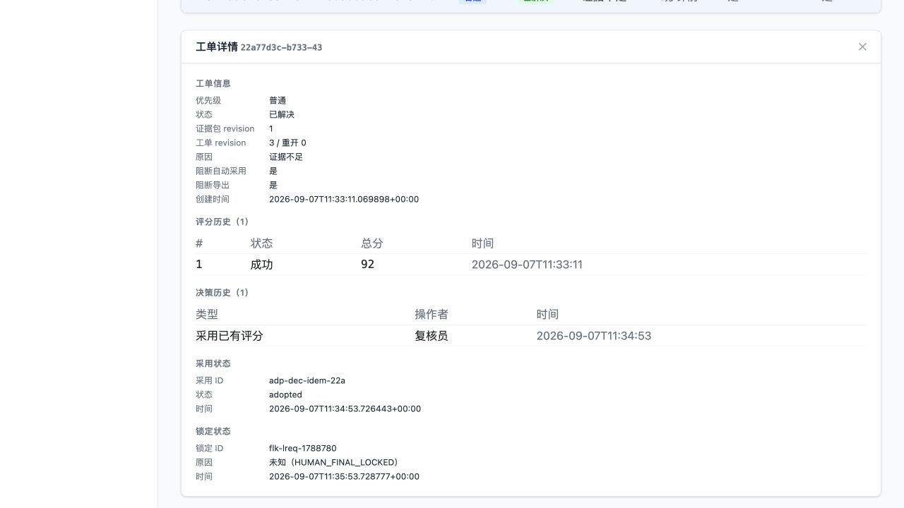

# 一次人工确认的操作记录

用一个92分的合成案例检查人工确认链路：在界面创建采用决定、采用结果并新建最终锁定，然后通过工单服务完成结案。

| 操作 | 结果 |
|---|---|
| 创建采用决定 | 201 |
| 采用结果 | 200 |
| 新建最终锁定 | 201 |
| 已锁定、工单未结案时请求结果 | 409，未结案阻断生效 |
| 工单结案后请求结果 | 200，权威来源为人工最终锁定，总分92 |

[200响应](examples/authoritative-result.json) · [409响应](examples/unresolved-blocked.json)

分数和评语为预置，采用、锁定、结案与结果请求是实际操作，没有调用模型。这份92分操作记录保留为早期复核证据。2026-09-08新增了同源Excel、Word和CSV导出；新的77分下载案例与复现步骤见[导出说明](EXPORTS.md)。下载不会自动改变任务的 `export/pending` 生命周期状态。

这组记录用于检查人工决定如何生效。材料、模型效果和完整批量交付需要各自验证。[结果推导代码](../backend/services/result_derivation_service.py) · [相关测试](../tests/test_result_derivation.py)
